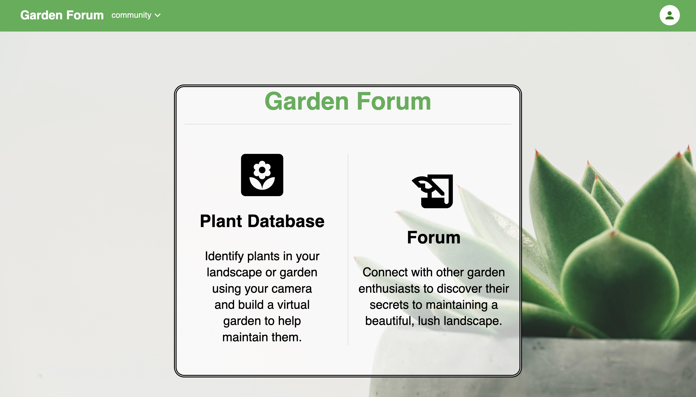
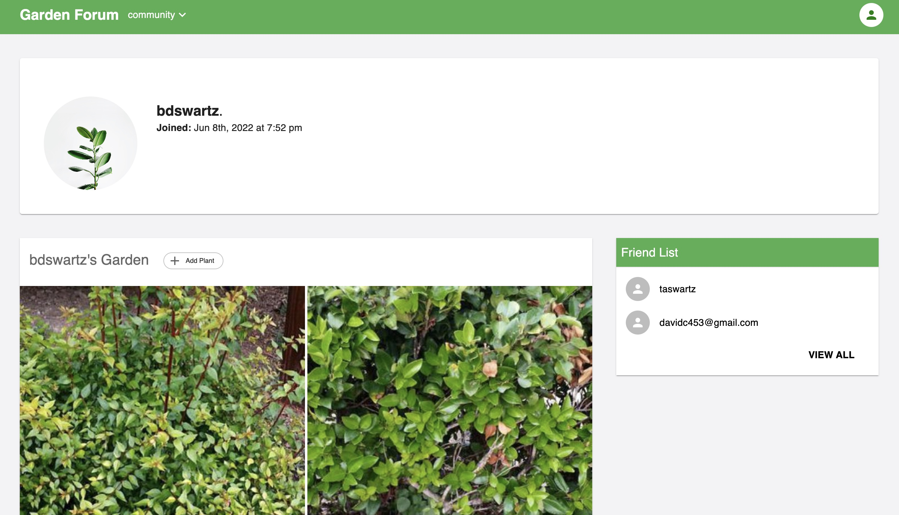
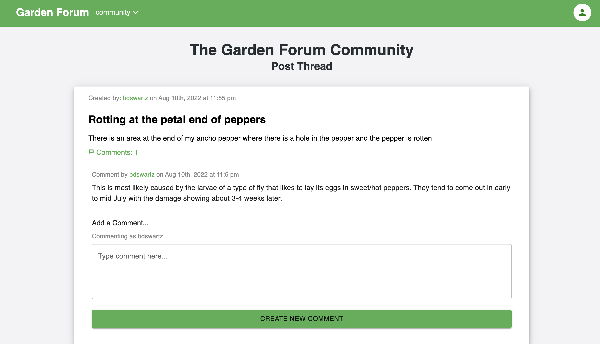

# [Welcome to the Garden Forum](https://gardenforum.herokuapp.com/)

#### The Garden Forum is a MERN full-stack website that gives everyday gardeners and home landscapers a tool to manage their plants.  

---

#### Collaborators:
*  [Brian Swartz](https://github.com/bdswartz)
*  [David Curtis](https://github.com/DavidebCurtis)
*  [Jacob Ambrose](https://github.com/jambrose0)
*  [Byron Stephenson](https://github.com/byron4455)
*  [Ernest Paul](https://github.com/Ernestpaul88)

---

## Installation
N/A - 

---

## Usage
A user can navigate from the landing page by signing up or logging in using the nav bar links.  Upon signing up or logging in, the user is routed to their profile dashboard.  Plants can then be added by the user populating plant information or by using the Plant.id API to identify a plant from a user-provided photo.

---

## Technologies

> <b>Development Tools:</b>
  * [MongoDB](https://www.mongodb.com/)
  * [Express.js](https://www.npmjs.com/package/express)
  * [React](https://reactjs.org/)
  * [Node.js](https://nodejs.org/en/)
  * [Mongoose package](https://www.npmjs.com/package/mongoose)
  * [JSON Web Tokens](https://www.npmjs.com/package/express-handlebars)
  * [Material UI](https://mui.com/)
  * [Apollo GraphQL](https://www.npmjs.com/package/apollo-graphql)
  * [Plant.id API](https://web.plant.id/)
  * [bcrypt](https://www.npmjs.com/package/bcrypt)

  ---

## User Story
### AS a home gardener or landscaper

Given that I want a website where I can get and store information necessary to maintain the plants that I am caring for:

### Acceptance Criteria for Minimum Viable Product

*  WHEN a user signs up or logs in
    THEN they are taken to their profile dashboard where they can view the plants in the garden and list of friends
*  WHEN a user clicks the “add plant” button
    THEN they are taken to a modal where they can upload a picture of a plant in their garden and send it for identification
*  WHEN a user clicks on a plant in their garden
    THEN they are taken to a plant page where they can modify information on that plant or add information/observations of that plants care and performance
*  WHEN a user goes to the Forum
    THEN they are taken to a dashboard where they can view forum topics or post their own new topic
*  WHEN a user clicks on a forum topic
    THEN that topic opens in another screen along with all comments on that topic and the ability for a user to add another comment to the topic

---

## Features
-  The site maintains a database of users and requires login so that the user's experience is personalized to them.
-  Uses Material UI component library in creation of custom components
-  Utilizes the Plant.id third party API by sending BASE64 string to identify a plant using a user provided photo
-  Utilizes mongoose ODM to aid in CRUD operations to the Mongo database.
-  Uses Apollo GraphQL queries and mutations to bring data to the React frontend.
-  User data is persistent using MongoDB.
-  Authentication is performed using a JSON Web Token with an expiration to control access inside the application.

---

Landing Page of Application

Profile Page with Users Garden

Forum Post with Comment and Comment Form

---

## Questions
Please visit our GitHub pages (listed above)

If there are any questions about the project,
feel free to send me an email at briandswartz@outlook.com